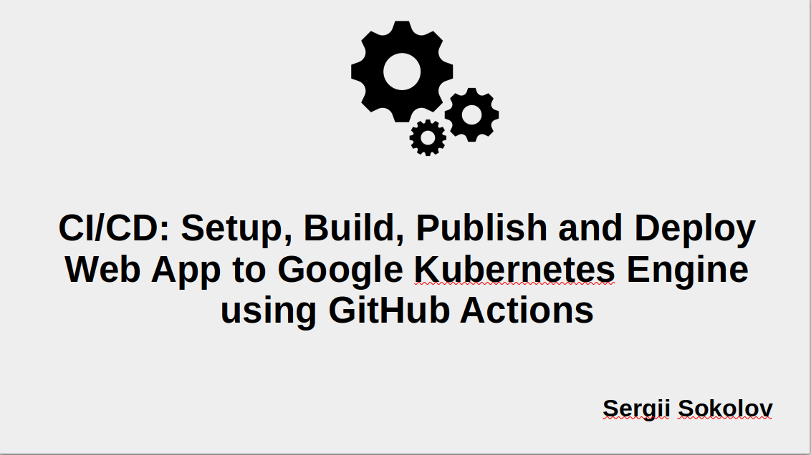
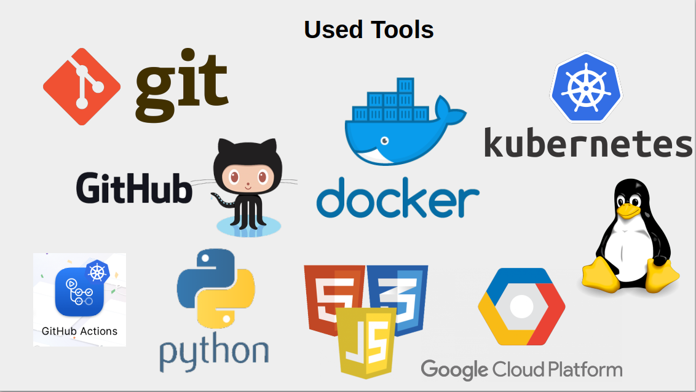
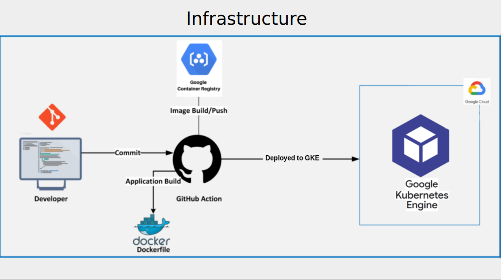
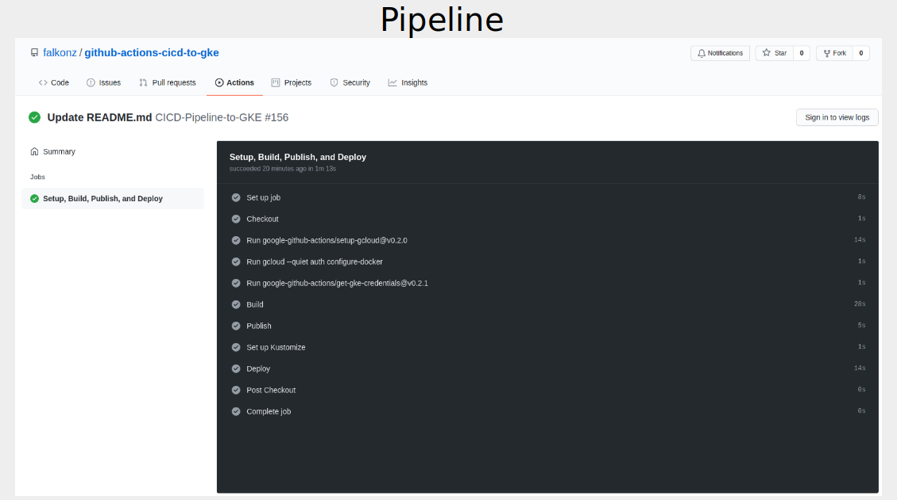
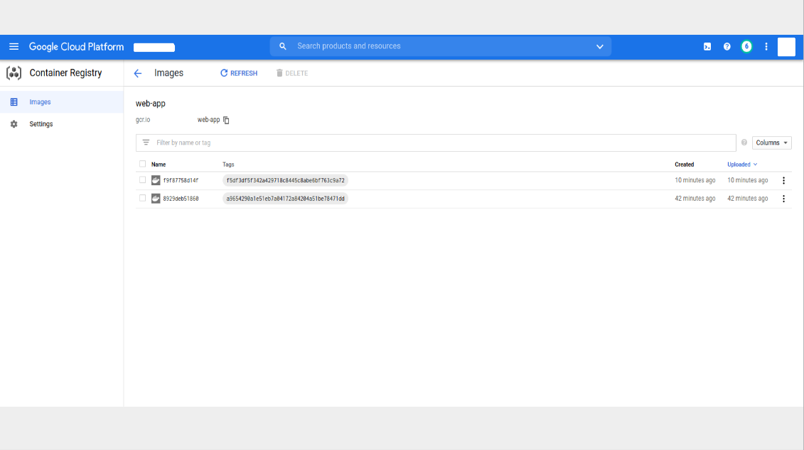
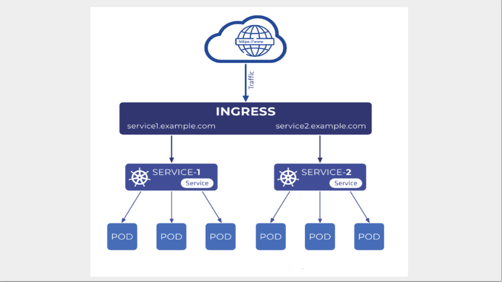
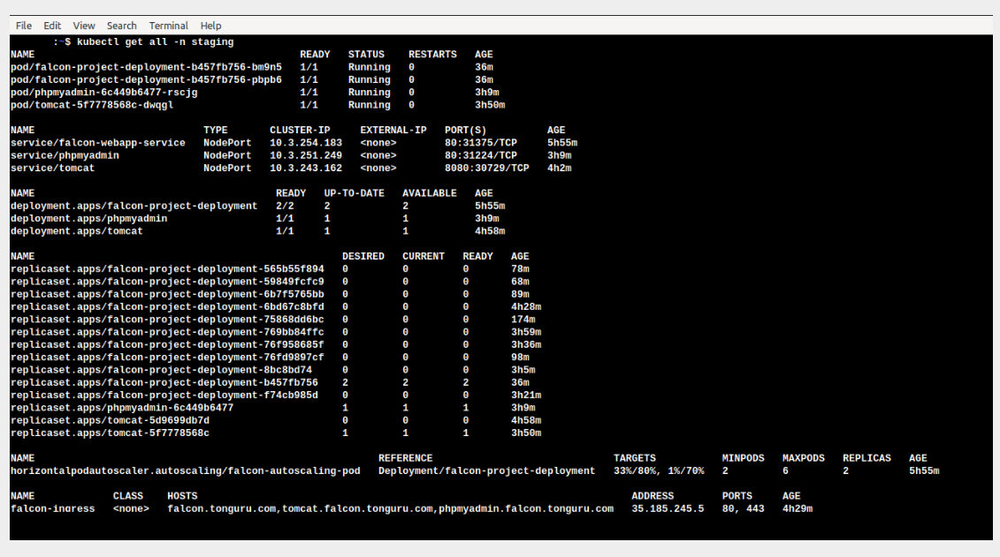
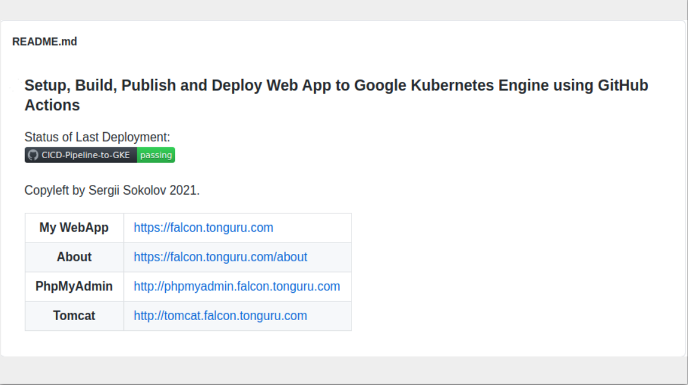
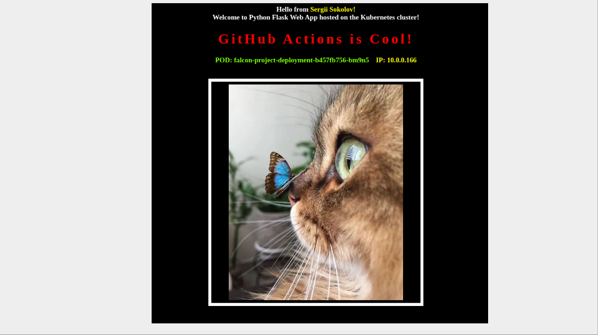
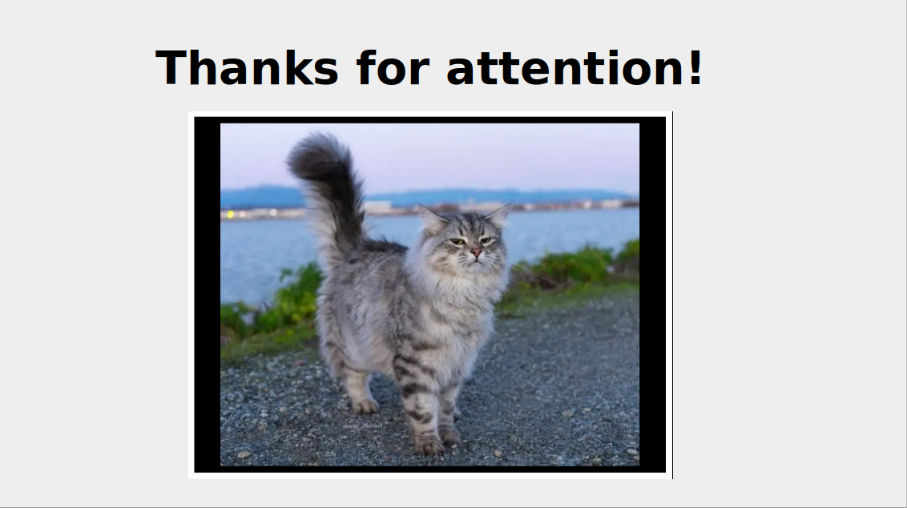

### Setup, Build, Publish and Deploy Web App to Google Kubernetes Engine using GitHub Actions

Status of Last Deployment: 

Copyleft by Sergii Sokolov 2021.

<table>
<tbody>
	<tr>
		<th>My WebApp</th>
		<td>https://falcon.tonguru.com</td>
	</tr>
  <tr>
		<th>About</th>
		<td>https://falcon.tonguru.com/about</td>
	</tr>
	<tr>
		<th>PhpMyAdmin</th>
		<td>http://phpmyadmin.falcon.tonguru.com</td>
  </tr>
	<tr>
		<th>Tomcat</th>
		<td>http://tomcat.falcon.tonguru.com</td>
  </tr>
</tbody>
</table>

